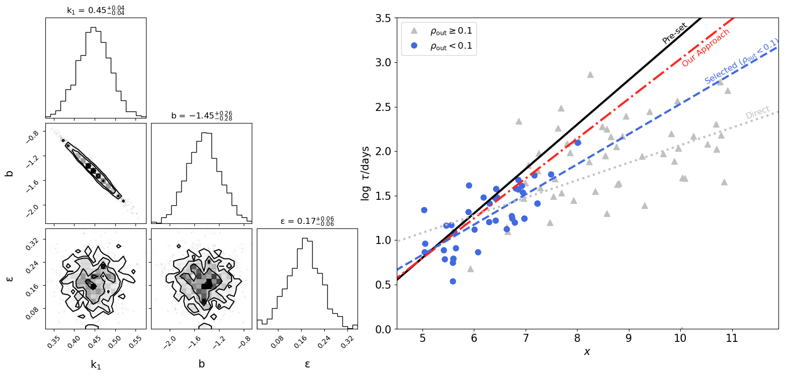

# ✨ BADDAT

**BADDAT** (Baseline-Aware Dependence fitting for DAmping Timescales) is a lightweight toolkit for forward modeling and statistical inference of AGN variability timescales and their dependence on physical parameters. It is particularly useful for addressing biases in DRW timescale measurements and exploring correlations with properties such as black hole mass, luminosity, and wavelength.




## 🔧 Dependencies and Code Attribution

This project makes use of and adapts portions of code from the following open-source libraries:

- [`taufit`](https://github.com/burke86/taufit) by Colin J. Burke – selected functions for DRW likelihood evaluation and modeling were adapted and modified.
- [`celerite`](https://github.com/dfm/celerite) by Foreman-Mackey et al. – parts of the Gaussian Process modeling framework were referenced and customized for this toolkit.

We thank the authors of these libraries for making their work openly available.

## 🚀 Getting Started

See `demo.ipynb` for a toy example demonstrating basic usage.

```python
flat_samples = DependenceFitter1(tau, baseline, n_cadence, log_M_BH).fit()
